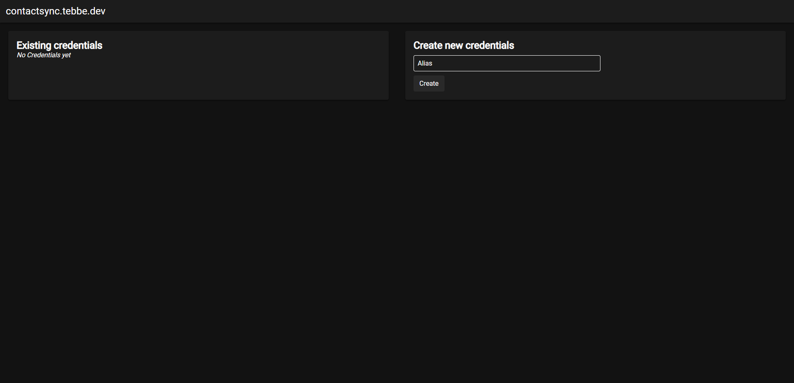
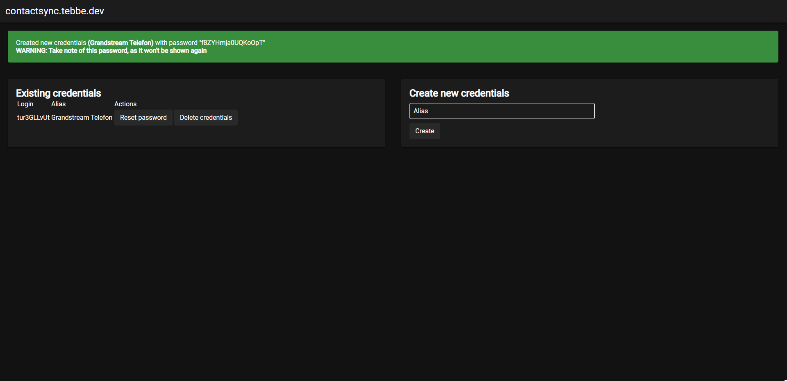

# contactsync.tebbe.dev
## Anwendungsfall

Nach Anschaffung eines Grandstream IP Telefons wollte ich meine Google Kontaktliste mit der internen des Telefons synchronisieren.  

## Umsetzung
Nach genauerer Betrachtung blieb nur der integrierte XML Import per HTTP bzw. HTTPS als Schnittstelle übrig.

Zum laden der Kontakte wird auf Google's "People API" gesetzt.

## Nutzung

**Die Liveversion des Projektes ist aus rechtlichen Gründen nur für meine G-Suite Organisation nutzbar.** 

Dieses Projekt erlaubt es einem sich mit Google als OAuth Provider anzumelden und anschließend Nutzernamen und Passwort Paare zu erstellen.   
Die generierten Zugangsdaten werden über HTTP Basic Authentifizierung an die API übergeben.  
Bei Aufruf der Schnittstelle werden automatisch die neuesten Daten von Google geladen.

Aus Datenschutzgründen werden keine Kontakte zwischengespeichert.
Sämtliche Passwörter werden verschlüsselt gespeichert.

## Screenshots
   
  

